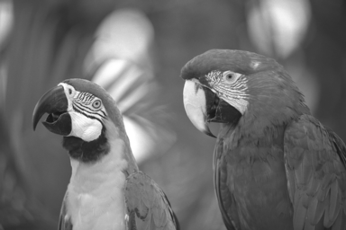
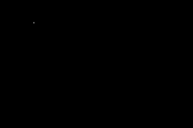
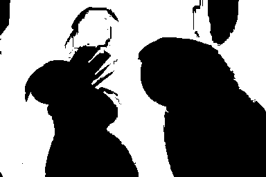
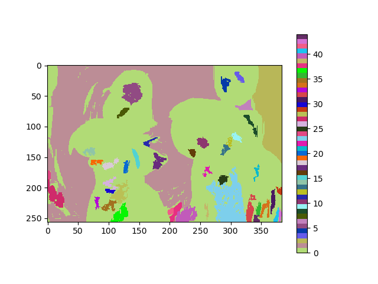
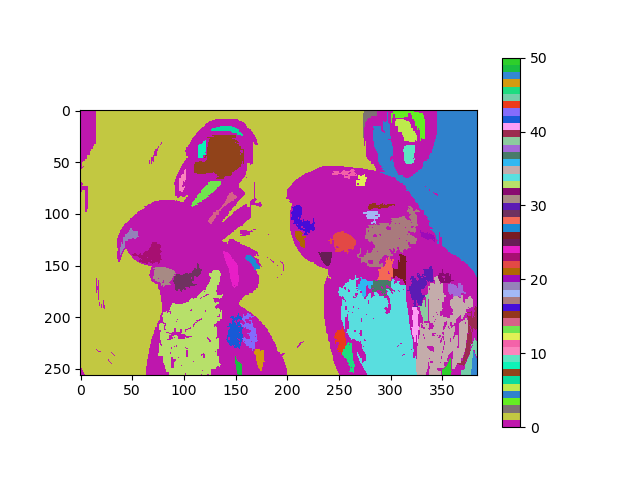

## Area Fill

### Input Image



### Input Image Connected Set for T = 2


### Input Image Connected Set for T = 1



### Input Image Connected Set for T = 3



### C code

```C
/**
 * @brief Finds the connected neighbors of a pixel
 *
 * @param s the input pixel
 * @param T the threshold used for finding neighbors
 * @param img a 2D array of pixels
 * @param width the width of the image
 * @param height the height of the image
 * @param M a pointer to the number of neighbors connected to the pixels
 * @param c an array containing the M connected neighbors to pixel s, where M <=
 * 4
 *
 * Algorithm:
 * 1. iterate over neighbors in the image
 * 2. if neighbor is within threshold, add it to list of connected neighbors and
 * increment number of neighbors
 */
void ConnectedNeighbors(pixel_t s, double T, unsigned char **img, int width,
                        int height, int *M, pixel_t c[4]) {
  // Define directions for neighbors: up, down, left, right
  int dx[] = {0, 0, -1, 1};
  int dy[] = {-1, 1, 0, 0};

  *M = 0;  // Initialize the number of connected neighbors

  // Iterate over possible neighbors
  for (int i = 0; i < 4; i++) {
    int n_col = s.col + dx[i];  // col coordinate of the neighbor
    int n_row = s.row + dy[i];  // row coordinate of the neighbor

    // Check if the neighbor is within the boundaries of the image
    if (n_col >= 0 && n_col < width && n_row >= 0 && n_row < height) {
      // Check if the difference in intensity is within the threshold
      if (abs(img[s.row][s.col] - img[n_row][n_col]) <= T) {
        // Add the connected neighbor to the list
        c[*M].col = n_col;
        c[*M].row = n_row;
        (*M)++;  // Increment the count of connected neighbors
      }
    }
  }
}

/**
 * @brief Sets a connected pixel group to a label in the image
 *
 * @param s
 * @param T
 * @param img
 * @param width
 * @param height
 * @param ClassLabel
 * @param seg
 * @param NumConPixels
 */
void ConnectedSet(pixel_t s, double T, unsigned char **img, int width,
                  int height, int ClassLabel, unsigned int **seg,
                  int *NumConPixels) {
  // add seed pixel to queue
  pixel_t B[width * height];
  int B_idx = 0;
  B[B_idx] = s;
  while (B_idx >= 0) {
    // pop a pixel, set it in the output image, and increment connected count
    pixel_t s = B[B_idx--];
    seg[s.row][s.col] = ClassLabel;
    (*NumConPixels)++;
    // get connected neighbors for the popped pixel
    pixel_t neighbors[4];
    int num_neighbors = 0;
    ConnectedNeighbors(s, T, img, width, height, &num_neighbors, neighbors);
    // printf("num_neighbors: %d\t", num_neighbors);
    // add neighbors to the queue if not already a part of seg
    for (int i = 0; i < num_neighbors; i++) {
      // printf("neighbor: %d, %d\t", neighbors[i].col, neighbors[i].row);
      if (seg[neighbors[i].row][neighbors[i].col] == 0) {
        // printf("adding neighbor: %d, %d\n", neighbors[i].col,
        // neighbors[i].row);
        B[++B_idx] = neighbors[i];
      }
    }
    // printf("B_idx: %d\n", B_idx);
  }
}

int AreaFill(unsigned char **img, int width, int height, double threshold,
             pixel_t s) {
  // Declare a double pointer
  unsigned int **seg;

  // Allocate memory for the array
  seg = (unsigned int **)malloc(height * sizeof(unsigned int *));
  if (seg == NULL) {
    printf("Memory allocation failed.\n");
    return 1;
  }

  for (int i = 0; i < height; i++) {
    seg[i] = (unsigned int *)malloc(width * sizeof(unsigned int));
    if (seg[i] == NULL) {
      printf("Memory allocation failed.\n");
      return 1;
    }
  }

  // Initialize the elements of the array
  for (int i = 0; i < height; i++) {
    for (int j = 0; j < width; j++) {
      seg[i][j] = 0;
    }
  }

  // find connected pixels
  int connected_pixels = 0;
  ConnectedSet(s, threshold, img, width, height, 1, seg, &connected_pixels);

  // set output image
  struct TIFF_img output_img;
  get_TIFF(&output_img, height, width, 'g');
  for (int i = 0; i < height; i++) {
    for (int j = 0; j < width; j++) {
      if (seg[i][j] == 1) {
        output_img.mono[i][j] = 255;
      } else {
        output_img.mono[i][j] = 0;
      }
    }
  }

  // Convert double to string
  char num_str[20];
  snprintf(num_str, sizeof(num_str), "%.2f", threshold);  // Example format %.2f

  // Construct file name with the double value
  FILE *fp;
  char output_file[50];
  strcpy(output_file, "../img/fill_");
  strcat(output_file, num_str);
  strcat(output_file, ".tif");
  if ((fp = fopen(output_file, "wb")) == NULL) {
    fprintf(stderr, "Error: failed to open output file\n");
    return EXIT_FAILURE;
  }

  // write seg image
  if (write_TIFF(fp, &output_img)) {
    fprintf(stderr, "Error: failed to write TIFF file\n");
    return EXIT_FAILURE;
  }

  // close seg image file
  fclose(fp);

  free_TIFF(&(output_img));

  return EXIT_SUCCESS;
}

int main(int argc, char **argv) {
  FILE *fp;
  struct TIFF_img input_img;

  if (argc != 3) {
    print_usage(argv[0]);
    return EXIT_FAILURE;
  }

  double threshold = atof(argv[2]);

  // open image file
  if ((fp = fopen(argv[1], "rb")) == NULL) {
    fprintf(stderr, "Error: failed to open file %s\n", argv[1]);
    return EXIT_FAILURE;
  }

  // read image
  if (read_TIFF(fp, &input_img)) {
    fprintf(stderr, "Error: failed to read file %s\n", argv[1]);
    return EXIT_FAILURE;
  }

  // close image file
  fclose(fp);

  // check image data type
  if (input_img.TIFF_type != 'g') {
    fprintf(stderr, "Error: image must be 8-bit grayscale\n");
    return EXIT_FAILURE;
  }

  int ret;
  pixel_t s = {.col = 67, .row = 45};
  ret =
      AreaFill(input_img.mono, input_img.width, input_img.height, threshold, s);
  if (ret == EXIT_FAILURE) {
    return ret;
  }
  printf("finished AreaFill\n");

  ret = GetAllConnectedSets(input_img.mono, input_img.width, input_img.height,
                            threshold, 100);
  if (ret == EXIT_FAILURE) {
    return ret;
  }
  printf("finished GetAllConnectedSets\n");

  free_TIFF(&(input_img));

  printf("done\n");

  return EXIT_SUCCESS;
}
```

## Image Segmentation

### Image Segmentation for T = 1

44 distinct pixel regions



### Image Segmentation for T = 2

50 distinct pixel regions



### Image Segmentation for T = 3

24 distinct pixel regions


### C code

```C
/**
 * @brief Get all the connected sets
 *
 * @param input_img
 * @param threshold
 * @param min_connected_pixels
 * @return int
 */
int GetAllConnectedSets(unsigned char **input_img, int width, int height,
                        double threshold, int min_connected_pixels) {
  // Declare a double pointer
  unsigned int **seg;

  // Allocate memory for the array
  seg = (unsigned int **)malloc(height * sizeof(unsigned int *));
  if (seg == NULL) {
    printf("Memory allocation failed.\n");
    return 1;
  }

  for (int i = 0; i < height; i++) {
    seg[i] = (unsigned int *)malloc(width * sizeof(unsigned int));
    if (seg[i] == NULL) {
      printf("Memory allocation failed.\n");
      return 1;
    }
  }

  // Initialize the elements of the array
  for (int i = 0; i < height; i++) {
    for (int j = 0; j < width; j++) {
      seg[i][j] = 0;
    }
  }

  // Initalize number of regions
  int total_regions = 0;

  // Iterate through each pixel in raster order
  for (int y = 0; y < height; y++) {
    for (int x = 0; x < width; x++) {
      // Check if the pixel already belongs to a connected set
      if (seg[y][x] == 0) {
        int connected_pixels = 0;
        struct pixel s = {y, x};
        // sets a connected set to a static label
        ConnectedSet(s, threshold, input_img, width, height, 255, seg,
                     &connected_pixels);
        total_regions++;
        // If the connected set has more than min_set_size pixels, assign a
        // sequential label starting from 1
        if (connected_pixels > min_connected_pixels) {
          printf("connected_pixels meets min: %d\n", connected_pixels);
          static unsigned int label = 1;
          // Label the connected set sequentially
          for (int i = 0; i < height; i++) {
            for (int j = 0; j < width; j++) {
              if (seg[i][j] == 255) {
                seg[i][j] = label;
              }
            }
          }
          printf("label: %d\n", label);
          label++;
        } else {
          // Otherwise, label the connected set as 0
          for (int i = 0; i < height; i++) {
            for (int j = 0; j < width; j++) {
              if (seg[i][j] == 255) {
                seg[i][j] = 0;
              }
            }
          }
        }
      }
    }
  }

  struct TIFF_img output_img;
  get_TIFF(&output_img, height, width, 'g');

  // set the output image to 0
  for (int i = 0; i < output_img.height; i++) {
    for (int j = 0; j < output_img.width; j++) {
      output_img.mono[i][j] = seg[i][j];
    }
  }

  // Convert double to string
  char num_str[20];
  snprintf(num_str, sizeof(num_str), "%.2f", threshold);  // Example format %.2f

  // Construct file name with the double value
  FILE *fp;
  char output_file[50];
  strcpy(output_file, "../img/segmentation_");
  strcat(output_file, num_str);
  strcat(output_file, ".tif");
  if ((fp = fopen(output_file, "wb")) == NULL) {
    fprintf(stderr, "Error: failed to open output file\n");
    return EXIT_FAILURE;
  }

  // write seg image
  if (write_TIFF(fp, &output_img)) {
    fprintf(stderr, "Error: failed to write TIFF file\n");
    return EXIT_FAILURE;
  }

  // close seg image file
  fclose(fp);

  free_TIFF(&(output_img));

  return EXIT_SUCCESS;
}

int main(int argc, char **argv) {
  FILE *fp;
  struct TIFF_img input_img;

  if (argc != 3) {
    print_usage(argv[0]);
    return EXIT_FAILURE;
  }

  double threshold = atof(argv[2]);

  // open image file
  if ((fp = fopen(argv[1], "rb")) == NULL) {
    fprintf(stderr, "Error: failed to open file %s\n", argv[1]);
    return EXIT_FAILURE;
  }

  // read image
  if (read_TIFF(fp, &input_img)) {
    fprintf(stderr, "Error: failed to read file %s\n", argv[1]);
    return EXIT_FAILURE;
  }

  // close image file
  fclose(fp);

  // check image data type
  if (input_img.TIFF_type != 'g') {
    fprintf(stderr, "Error: image must be 8-bit grayscale\n");
    return EXIT_FAILURE;
  }

  int ret;
  pixel_t s = {.col = 67, .row = 45};
  ret =
      AreaFill(input_img.mono, input_img.width, input_img.height, threshold, s);
  if (ret == EXIT_FAILURE) {
    return ret;
  }
  printf("finished AreaFill\n");

  ret = GetAllConnectedSets(input_img.mono, input_img.width, input_img.height,
                            threshold, 100);
  if (ret == EXIT_FAILURE) {
    return ret;
  }
  printf("finished GetAllConnectedSets\n");

  free_TIFF(&(input_img));

  printf("done\n");

  return EXIT_SUCCESS;
}

void print_usage(const char *program_name) {
  printf("Usage: %s <image-file-path>\n", program_name);
  printf("Arguments:\n");
  printf("  <image-file-path> : Specify the file path of the image.\n");
  printf(
      "  <threshold> : Specify the threshold number for determining pixel "
      "neighbors.\n");
}

```